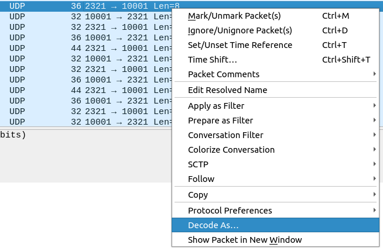
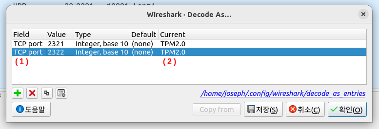
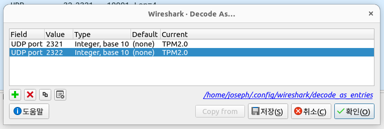

# tpm2-proxy-framework

# SAMPLE

```typescript
import * as tpm2proxy from './index';
import {sprintf} from 'sprintf';

export function hexdump(data: Buffer): string {
  let remaining = data.length;
  let position = 0;
  const output: string[] = [];
  while (remaining > 0) {
    const start = position;
    const end = Math.min(start + 16, data.length);
    const chunk = data.subarray(start, end);
    let text = sprintf('%08x: ', start);
    text += [...chunk].map((v) => sprintf('%02x', v)).join(' ');
    remaining -= 16;
    position += 16;
    output.push(text);
  }
  return output.join('\n');
}

function hexdump2(title: string, packet: tpm2proxy.tpm2.Packet): void {
  const lines = [
    `${title}:`,
    `    TAG : 0x${packet.tag.toString(16)}`,
    `    SIZE: 0x${packet.size.toString(16)}`,
    `    CODE: 0x${packet.code.toString(16)}`,
    hexdump(packet.raw).replace(/^/mg, '    '),
    ''
  ];
  console.log(lines.join('\n'));
}

async function run() {
  const upstream = new tpm2proxy.driver.SwtpmUpstreamDriver();
  const downstream = new tpm2proxy.driver.SwtpmProxyDriver();
  const proxy = new tpm2proxy.Tpm2Proxy({
    upstream,
    downstream,
    writePcap: {
      path: `./tpm-capture-${new Date().getTime()}.pcap`
    },
    onUpstreamData: (packet: tpm2proxy.tpm2.Packet) => {
      hexdump2('UPSTREAM DATA', packet);
      return proxy.writeToDownstream(packet);
    },
    onDownstreamData: (packet: tpm2proxy.tpm2.Packet) => {
      hexdump2('DOWNSTREAM DATA', packet);
      return proxy.writeToUpstream(packet);
    }
  });

  await upstream.connect({
    ctrl: 'type=tcp,port=55169',
    data: 'type=tcp,port=56169'
  });
  console.log('upstream connected');
  await downstream.listenAndWait({
    frontendControl: 'unix:path=/tmp/proxy-ctrl.sock,mode=777'
  });
  console.log('downstream connected');
  upstream.resume();
  downstream.resume();
}

run();
```

# Guide

## Open pcap in Wireshark



* Click `Decode As ...`



* Change Field to `TCP port` from `UDP port`
* Change Current to `TPM2.0`
* Add 2322 as same



* Change Field to `UDP port` from `TCP port`
* Save

# License

[Apache-2.0](./LICENSE)
